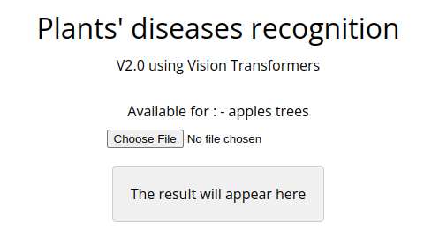

# aicg-week3-transformers
VIT (Vision Transformers) from scratch with pytorch - to classify plants' diseases images on web

## Goals
I realized this project as a part of the AICG course week3 from the IFT program. I had to use transformers to analyse sequences.

The instructions were to render a web page - to show the possibilities of our model - using transformers coded from scratch.

I decided to apply transformers on vision - has the paper "An Image is Worth 16x16 Words" showed that it was possible in preprocessing the images to get sequences as in NLP.

--------

## Project Structure

The project is organized as follows:

- `train.py` file containing all the necessities totrain/fit the model - I transform the images in multiple patches to reduce the number of data pass through the encoder part of my transformer - I also add a classifier token and sum the pathces embedding to a position embedding. Then i create the encoder using a classic transformer architecture - I fnnaly get the class belonging to the images input as a result. The model is exported to a .pt.  The live model was trained over 1300 epochs.
- `to_onnx.py` file to transform model from .pt to .onnx
- `dataset` folder containing images to train the model and dataframe to store the class of these images - this dataset comme from this kaggle contest : https://www.kaggle.com/competitions/plant-pathology-2020-fgvc7/overview

## Usage
This program is running on a web page hosted by github

1.  Go to : https://arthurszantyr.github.io/aicg-week3-transformers/

  

2.  Click on "Choose File" and select a JPEG image file - showing a plant leaf

__additional feature on smartphone__
    
    you can directly take a picture instead of selecting a file

3. The model will analyze the image - and return the disease or not of your tree

  

